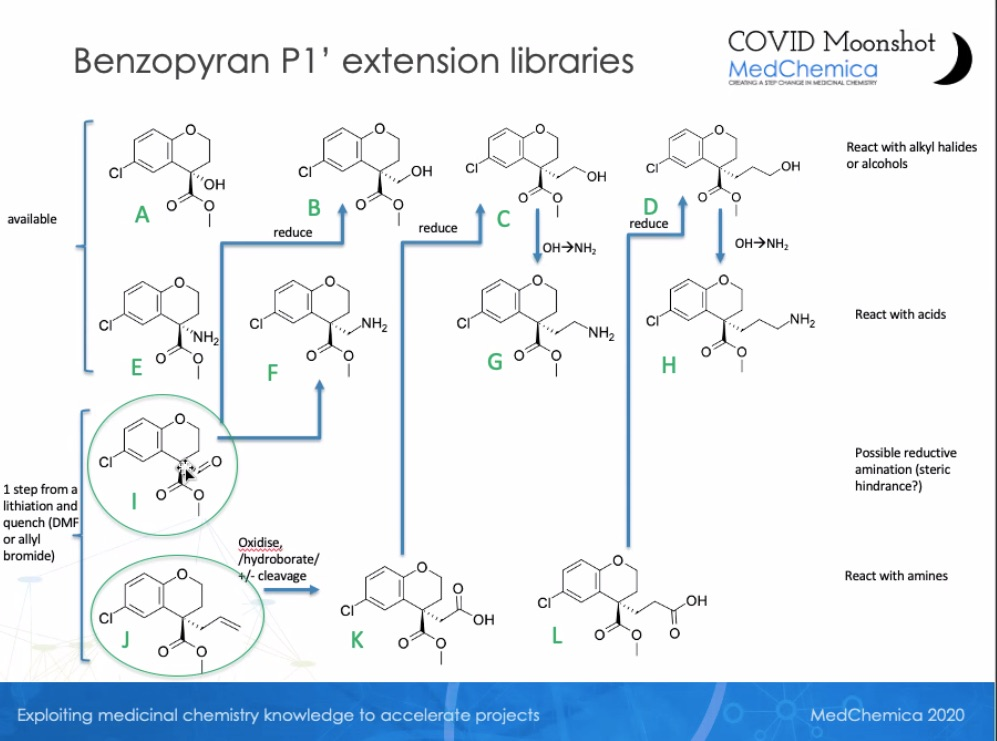

# Folding@home Sprint 5 for the COVID Moonshot

## Objectives

This sprint evaluates potential P1' substituents building on the isoquinoline series (formerly 3-the aminopyridine series) to attempt to pick up more affinity for this lead series.

### Relevant compounds

Current best designs in the isoquinoline series with activity data posted to https://covid.postera.ai/covid/activity_data
* [MAT-POS-b3e365b9-1](https://covid.postera.ai/covid/submissions/b3e365b9-9ba1-48cb-bc05-132b14d906ad/1) - P2 chromane substituent
* [EDJ-MED-e4b030d8-11](https://covid.postera.ai/covid/submissions/e4b030d8-07e5-493e-9d39-08cc0d13fe2a/11) - P2 chromane
* [MAT-POS-0c8fa4a7-1](https://covid.postera.ai/covid/submissions/0c8fa4a7-61d8-4922-a497-31702c6fe8d9/1) - P2 pocket dihydronaphtalene
* [ALP-POS-477dc5b7-2](https://covid.postera.ai/covid/submissions/477dc5b7-c3e5-450b-9b3b-95b8e2489337/2) - P2 pocket tetrahydroquinoline
* [ALP-POS-3b848b35-2](https://covid.postera.ai/covid/submissions/3b848b35-7bf7-4558-b8ed-d87c25240d91/2) - P4 beta-lactam (suspected liability)

Molecules with data in CDD that has not yet been posted to https://covid.postera.ai/covid/activity_data
* [ALP-POS-477dc5b7-3](https://covid.postera.ai/covid/submissions/ALP-POS-477dc5b7-3) - chromane with possible P1 substituent
* [EDJ-MED-e4b030d8-13](https://covid.postera.ai/covid/submissions/EDJ-MED-e4b030d8-13) - chromane with methyl group pointing at P1

### Relevant X-ray structures

These structures appear to contain the common isoquinoline-based scaffold:

11424
* [VLA-UCB-1dbca3b4-15](https://covid.postera.ai/covid/submissions/1dbca3b4-ea20-473e-b578-99bed7ee3628/15) - [x11498](https://fragalysis.diamond.ac.uk/viewer/react/preview/direct/target/Mpro/mols/x11498/L/P/C) -
* [MAT-POS-8a69d52e-7](https://covid.postera.ai/covid/submissions/8a69d52e-e503-4d6a-bb9e-08aaacc98466/7) - [x12073](https://fragalysis.diamond.ac.uk/viewer/react/preview/direct/target/Mpro/mols/x12073/L/P/C)

A superposition of these structures can be viewed on Fragalysis [here](https://fragalysis.diamond.ac.uk/viewer/react/projects/295/235).

Observations:
* His163: His163 ND deprotonated to hydrogen bond with Tyr161 OH; either His163 NE protonated and isoquinoline scaffold N deprotonated, or vice-versa to form hydrogen bond
* His164: His164 ND likely protonated to orient chromane Cl; NE likely protonated to donate hydrogen bond to Thr175 OG
* Gln189 NE-H2 hydrogen bond with chromane O
* linker C=O hydrogen bonds with protein backbone Glu166 NH
* Protonation states of Cys145 indeterminate: Cys145 SG- could interact with linker N and His41 NE protonated; His41 ND not interacting with anything but protonated could help stabilize ligand -Cl substituent

Required scaffold interactions:
* isoquinoline N - His163 NE
* linker C=O - Glu166 backbone N

Other scaffold interactions:
* isoquinoline `c1cn[c:1]c2ccccc12` - Phe140 O
* isoquinoline `c1cn[c:1]c2ccccc12` - Phe140 O

Other interactions of note:
* chromane O - Gln189 NE
* chromane Cl substituent - His164 ND
* chromane Cl substituent - His164 ND

Other Fragalysis structures of interest:

#### Benzopyrans
* [JAG-UCB-119787ef-1](https://postera.ai/covid/submissions/JAG-UCB-119787ef-1) - [x10898](https://fragalysis.diamond.ac.uk/viewer/react/preview/direct/target/Mpro/mols/x10898/L/P/C)
* [MAT-POS-968e8d9c-1](https://postera.ai/covid/submissions/MAT-POS-968e8d9c-1) - [x10906](https://fragalysis.diamond.ac.uk/viewer/react/preview/direct/target/Mpro/mols/x10906/L/P/C)
* [LON-WEI-0a73fcb8-7](https://postera.ai/covid/submissions/LON-WEI-0a73fcb8-7) - [x10942](https://fragalysis.diamond.ac.uk/viewer/react/preview/direct/target/Mpro/mols/x10942/L/P/C)
* [EDJ-MED-0e996074-1](https://postera.ai/covid/submissions/EDJ-MED-0e996074-1) - [x11159](https://fragalysis.diamond.ac.uk/viewer/react/preview/direct/target/Mpro/mols/x11159/L/P/C)
* [BRU-THA-a358fbdd-2](https://postera.ai/covid/submissions/RU-THA-a358fbdd-2) - [x11233](https://fragalysis.diamond.ac.uk/viewer/react/preview/direct/target/Mpro/mols/x11233/L/P/C)


## Plan

Our initial goal is to determine which of the 10 distinct intermediates we should make in bulk:
* 2 of these are commercial
* the other 8 are derived from 2 other intermediates

We aim to cluster related compounds to reduce the variance in our estimates.

## List of transformations to generate

* Transformations between X-ray structures
* Transformations from X-ray structures to all compounds that have been assayed or queued for synthesis
* Transformations from X-ray structures to all proposed intermediates
* Transformations from all proposed intermediates to subsets (small transformations, good docking scores) of each intermediate, interleaved by intermediate
* Transformations from X-ray structures to all submitted designs not queued for synthesis
* Transformations from all proposed intermediates to all possible designs [CLUSTERED?]

## Notes

We just got data for these, and should be sure to include them:

Synthetic intermediates:


## Manifest


Intermediates
* `intermediates/benzopyran_sprint_5_intermediates.csv`

Filtered for
* `filtered/filtered_alkyl_halide_bb_ether_synthesis_for_FEP.smi`
* `filtered/filtered_amine_bb_amide_couplings_for_FEP.smi`
* `filtered/filtered_cooh_bb_amide_couplings_for_FEP.smi`

Here are the filtered lists with a unique ID for every compound. Since there were so many molecules, I used Lilly's rules, which are easier to run in high-throughput (since I couldn't do all these by hand). You'll notice that the number of "demerits": "D()" is still included in the final files, which you can use if you want to shorten the list further. Of those that were not filtered out, the main demerit is simply having many atoms. Not sure, but could be a decent predictor of FEP challenges.

A group of commands like this should give you what you need in Pandas:
```
df = pd.read_csv('filtered_alkyl_halide_bb_ether_synthesis_for_FEP.smi', sep=' ', header=None)
df = df.rename(columns={0: 'SMILES', 1: 'ID', 3:'demerits', 4:'reason_for_demerits'})
df['demerits'] = df['demerits'].apply(lambda x: int(x.split('(')[-1].split(')')[0]))
df = df.drop(columns=2)
```

Larger D() score is indeed worse. According to Lilly's rules, everything >= D(100) is filtered out.
